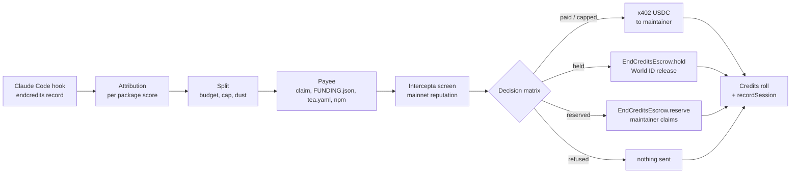

# End Credits

**Your AI agent pays every open-source project it used, and never pays the scammers pretending to be
them.**

ETHGlobal Tokyo 2026. Solo build by Faisal ([`zexoverz`](https://github.com/zexoverz)).

| | |
|---|---|
| App | https://end-credits.up.railway.app |
| Dashboard (MultiBaas) | https://end-credits.up.railway.app/dashboard |
| Decision history | https://end-credits.up.railway.app/history |
| `EndCreditsEscrow` on Basescan | https://sepolia.basescan.org/address/0x63047583FbCe241D72d71137C940aa27BBdC60f1#code |
| `EndCreditsEscrow` on Sourcify (`exact_match`) | https://repo.sourcify.dev/84532/0x63047583FbCe241D72d71137C940aa27BBdC60f1 |

## Why

- Open source software is worth $8.8T on the demand side and would cost $4.15B to recreate
  ([Hoffmann, Nagle, Zhou, HBS Working Paper 24-038](https://www.hbs.edu/faculty/Pages/item.aspx?num=65230)).
- "Traffic to our docs is down about 40% from early 2023 despite Tailwind being more popular than
  ever", and "75% of the people on our engineering team lost their jobs"
  ([Adam Wathan, 7 Jan 2026, tailwindlabs/tailwindcss.com#2388](https://github.com/tailwindlabs/tailwindcss.com/pull/2388)).
  Agents read the docs and the source, and never reach the page that asks for support.
- Of the top 1,000 npm packages, 41.6% publish some funding metadata but only 2.1% publish a wallet an
  agent could pay ([our measurement](#measurement), 25 Sep 2026).

## Not a paywall

End Credits is opt-in for whoever runs the agent. Packages stay free for everyone.

Nothing changes for anyone who does not install the hook. Money flows one way: from an owner who set
a budget to the maintainers of what their agent used.

## How it works

1. **Hook.** `endcredits init` adds `SessionStart`, `PostToolUse` and `SessionEnd` hooks to
   `.claude/settings.json` ([`cli/src/init.ts`](cli/src/init.ts)). `record` appends one ledger line
   per relevant tool call, always exits 0 and prints nothing ([`cli/src/record.ts`](cli/src/record.ts)).
2. **Attribution.** At session end the CLI scores each installed package from imports, installs,
   docs fetches and reads ([`lib/attribution/score.ts`](lib/attribution/score.ts)) and uploads
   package names, signal types and counts. No code, no repo paths.
3. **Split.** The settler recomputes scores server side ([`lib/settle/scores.ts`](lib/settle/scores.ts))
   and water-fills the session budget under the per-package cap; shares under 0.01 USDC are `dust`
   ([`lib/allocation/split.ts`](lib/allocation/split.ts)). The daily limit applies first.
4. **Payee.** First hit wins: our on-chain claim, Drips `FUNDING.json`, `tea.yaml`, an address in the
   npm `funding` field ([`lib/payee/resolve.ts`](lib/payee/resolve.ts)). The repo's `package.json`
   must publish the same name, else the share is reserved as `SPOOF_REPO`
   ([`lib/payee/spoof.ts`](lib/payee/spoof.ts)). Address changes are judged from our own observation
   times and GitHub push times, never commit dates ([`lib/payee/change.ts`](lib/payee/change.ts),
   [`lib/payee/push.ts`](lib/payee/push.ts)).
5. **Screen.** Every payee is screened by Intercepta before anything is signed (see
   [Intercepta](#intercepta)).
6. **Decide and execute.** The matrix below picks one outcome; the decision is stored before any
   signature ([`lib/settle/settle.ts#L228-L250`](lib/settle/settle.ts#L228-L250)).
7. **Roll.** `/credits/<id>` lists every package with its badge, reason and Basescan link; the
   recorder emits one `SessionSettled` event per session with a manifest hash.

TODO(live): roll screenshot from the recorded demo session.

### Outcomes

| Badge | Meaning | Money |
|---|---|---|
| `paid` | clean payee, paid in full | x402 transfer to the maintainer; Basescan link |
| `capped` | clean payee, share cut to the per-package cap | x402 transfer of the capped amount; the excess went to other packages |
| `held` | a doubt: funding address changed recently, medium risk, or screening unavailable | in escrow; released on a World-approved owner decision; refunded on deny or expiry |
| `refused` | high risk: sanctioned, known scammer, phishing, impersonation, lookalike address, or a spam payout pattern | not sent; stays with the owner |
| `reserved` | the package lists no wallet | in escrow under the package key until the maintainer claims |

Shares under 0.01 USDC are `dust` and never sent. A payee lookup that fails (registry, GitHub or RPC
down twice) is `refused` with `RESOLVE_FAILED`, so the money stays with the owner.

### Decision matrix, as built

[`lib/decision/matrix.ts`](lib/decision/matrix.ts). First match wins. Thresholds are ours.

| # | Condition | Outcome | Message code |
|---|---|---|---|
| 1 | no payee | `reserved` (screened later, at claim) | `RESERVED` |
| 2 | payment token is not Base Sepolia USDC | `refused` | `TOKEN_PIN` |
| 2 | Intercepta token risks `action == block` | `refused` | detector text |
| 3 | screen timeout, HTTP error or unparsable body | `held` | `SCREEN_UNAVAILABLE` |
| 4 | a critical trait (`sanction_address`, `known_scammer`, `blacklist`, `fake_phishing_transfer`, or a simulation detector naming the recipient) | `refused` | `REFUSED_TRAIT`, Intercepta's description verbatim |
| 4 | `toxicScore > 50` | `refused` | `REFUSED_TRAIT` |
| 4 | Intercepta impersonation check says address poisoning | `refused` | `IMPERSONATION` |
| 4 | our lookalike rule: same first 4 and last 4 hex as another known payee, different address | `refused` | `LOOKALIKE` (labelled as ours) |
| 4 | our spam rule: same payee for 5+ packages in the session, each new or under 1,000 weekly downloads | `refused` | `SPAM` |
| 5 | funding address changed in the last 30 days | `held` | `HELD_CHANGED` |
| 6 | `20 <= toxicScore <= 50`, or token `action == warn` | `held` | `HELD_MEDIUM` |
| 7 | contract on Ethereum with no code on Base (only with `CHECK_NO_CODE=true`) | `held` | `HELD_NO_CODE` |
| 8 | otherwise | `capped` if the split capped it, else `paid` | `CAPPED` / `PAID` |

Every decision made on a successful screen also carries `SCREENED_AS`: "Screened as its mainnet
equivalent (Base, chain 8453)." All user-facing text is in [`lib/messages.ts`](lib/messages.ts).
