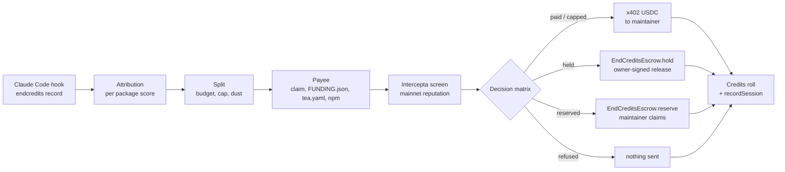

# End Credits

Every claim below has a transaction or page to check it against: see [VERIFY.md](VERIFY.md).

**Your AI agent pays every open-source project it used, and never pays the scammers pretending to be
them.**

End Credits splits the owner's budget across the open-source packages a Claude Code session used,
screens every payee with Intercepta before signing, pays clean ones over x402, and holds or reserves
the rest in an escrow that only the owner's wallet can release from.

ETHGlobal Tokyo 2026. Solo build by Faisal ([`zexoverz`](https://github.com/zexoverz)). Partners:
**Intercepta** ([the moment of decision](#intercepta-the-moment-of-decision)) and **Curvegrid
MultiBaas** ([how it is used](#curvegrid-multibaas)).

| | |
|---|---|
| App | https://end-credits.up.railway.app |
| Dashboard (MultiBaas) | https://end-credits.up.railway.app/dashboard |
| Decision history | https://end-credits.up.railway.app/history |
| First live settlement (roll) | https://end-credits.up.railway.app/credits/9233161f-1de0-4161-abc8-387379cc2b8b |
| `EndCreditsEscrow` on Basescan | https://sepolia.basescan.org/address/0x849F6cd44e4A3248d033aBB1b670257F77bFCc46#code |
| `EndCreditsEscrow` on Sourcify (`exact_match`) | https://repo.sourcify.dev/84532/0x849F6cd44e4A3248d033aBB1b670257F77bFCc46 |
| `EndCreditsBudget` on Basescan (Sourcify `exact_match`) | https://sepolia.basescan.org/address/0x1429498c0e6f2f474a5bd3230e79a838e3590b36#code |

## Why

- Open source software is worth $8.8T on the demand side and would cost $4.15B to recreate
  ([Hoffmann, Nagle, Zhou, HBS Working Paper 24-038](https://www.hbs.edu/faculty/Pages/item.aspx?num=65230)).
- "Traffic to our docs is down about 40% from early 2023 despite Tailwind being more popular than
  ever", and "75% of the people on our engineering team lost their jobs"
  ([Adam Wathan, 7 Jan 2026, tailwindlabs/tailwindcss.com#2388](https://github.com/tailwindlabs/tailwindcss.com/pull/2388)).
  Agents read the docs and the source, and never reach the page that asks for support.
- Of the top 1,000 npm packages, 41.6% publish some funding metadata but only 2.1% publish a wallet an
  agent could pay ([our measurement](#measurement), 25 Sep 2026).

## Not a paywall

End Credits is opt-in for whoever runs the agent. Packages stay free for everyone.

Nothing changes for anyone who does not install the hook. Money flows one way: from an owner who set
a budget to the maintainers of what their agent used.

## How it works



1. **Hook.** `endcredits init` adds `SessionStart`, `PostToolUse` and `SessionEnd` hooks to
   `.claude/settings.json` ([`cli/src/init.ts`](cli/src/init.ts)). `record` appends one ledger line
   per relevant tool call, always exits 0 and prints nothing ([`cli/src/record.ts`](cli/src/record.ts)).
2. **Attribution.** At session end the CLI scores each installed package from imports, installs,
   docs fetches and reads ([`lib/attribution/score.ts`](lib/attribution/score.ts)) and uploads
   package names, signal types and counts. No code, no repo paths.
3. **Split.** The settler recomputes scores server side ([`lib/settle/scores.ts`](lib/settle/scores.ts))
   and water-fills the session budget under the per-package cap; shares under 0.01 USDC are `dust`
   ([`lib/allocation/split.ts`](lib/allocation/split.ts)). The daily limit applies first.
4. **Payee.** First hit wins: our on-chain claim, Drips `FUNDING.json`, `tea.yaml`, an address in the
   npm `funding` field ([`lib/payee/resolve.ts`](lib/payee/resolve.ts)). The repo's `package.json`
   must publish the same name, else the share is reserved as `SPOOF_REPO`
   ([`lib/payee/spoof.ts`](lib/payee/spoof.ts)). Address changes are judged from our own observation
   times and GitHub push times, never commit dates ([`lib/payee/change.ts`](lib/payee/change.ts),
   [`lib/payee/push.ts`](lib/payee/push.ts)).
5. **Screen.** Every payee is screened by Intercepta before anything is signed (see
   [Intercepta](#intercepta-the-moment-of-decision)).
6. **Decide, pull, execute.** The [matrix](#decision-matrix-as-built) picks one outcome per package
   and every decision is stored first ([`lib/settle/settle.ts#L292-L332`](lib/settle/settle.ts#L292-L332)).
   Then the settler pulls exactly what will move from the owner's wallet (see
   [Money never sits on our server](#money-never-sits-on-our-server)), and only then pays, holds or
   reserves ([`#L168-L172`](lib/settle/settle.ts#L168-L172)).
7. **Roll.** `/credits/<id>` lists every package with its badge, reason and Basescan link; the
   recorder emits one `SessionSettled` event per session with a manifest hash.

TODO(live): roll screenshot from the recorded demo session.

### Outcomes

| Badge | Meaning | Money |
|---|---|---|
| `paid` | clean payee, paid in full | x402 transfer to the maintainer; Basescan link |
| `capped` | clean payee, share cut to the per-package cap | x402 transfer of the capped amount; the excess went to other packages |
| `held` | a doubt: funding address changed recently, medium risk, or screening unavailable | in escrow; released only with the owner's approver wallet signature (EIP-712, checked on chain); refunded on deny or expiry |
| `refused` | high risk: sanctioned, known scammer, phishing, impersonation, lookalike address, or a spam payout pattern | not sent; stays with the owner |
| `reserved` | the package lists no wallet | in escrow under the package key until the maintainer claims |

Shares under 0.01 USDC are `dust` and never sent. A payee lookup that fails (registry, GitHub or RPC
down twice) is `refused` with `RESOLVE_FAILED`, so the money stays with the owner.

## Intercepta: the moment of decision

Every payee is screened live by Intercepta before a payment is signed or a hold is sent, and the
answer picks what happens to the money. We pay on Base Sepolia, but the payees are the real
addresses maintainers published, so their **mainnet** reputation is what gets screened.

The order, per credit, in [`lib/settle/settle.ts`](lib/settle/settle.ts):

1. Screen the payee ([`#L302-L303`](lib/settle/settle.ts#L302-L303)). A screen that throws becomes
   `error: "HTTP"` ([`#L403-L410`](lib/settle/settle.ts#L403-L410)), which holds.
2. `decide` runs the matrix on the screen ([`#L304-L315`](lib/settle/settle.ts#L304-L315)).
3. The decision and its reasons are stored, with the ids of the screens that produced it
   ([`#L322-L331`](lib/settle/settle.ts#L322-L331)), for every credit of the session.
4. Only then is money pulled from the owner's budget and anything signed or sent
   ([`#L168-L172`](lib/settle/settle.ts#L168-L172), [`#L355-L401`](lib/settle/settle.ts#L355-L401)):
   x402 for `paid` / `capped`, `hold` or `reserve` on the escrow, nothing for `refused`.
5. At signing time the x402 client checks the 402 challenge against the screened payee and the
   stored decision ([`lib/x402/client.ts#L39-L68`](lib/x402/client.ts#L39-L68)), and the resource
   refuses to quote a credit whose payee has no successful screen from the last 10 minutes
   ([`lib/x402/server.ts#L82-L90`](lib/x402/server.ts#L82-L90)).

Timeout or error from Intercepta means hold, never pay. Every call is retried once, 500 ms later, on
a timeout, a network error, a 5xx or a 429, and both attempts are stored
([`lib/intercepta/http.ts#L51-L56`](lib/intercepta/http.ts#L51-L56),
[`lib/intercepta/client.ts#L76-L81`](lib/intercepta/client.ts#L76-L81)). In production one
impersonation check timed out at 8 s while the quick scan for the same address answered clean in
about 1 s, and a clean payee held as `SCREEN_UNAVAILABLE`. One slow request should not decide a
payee. A second failure still holds.

### The paid side: our x402 route screens who pays

Our resource `GET /api/x402/credit/{creditId}` is a paid service too, so it screens the payer. After
the signed payment matches the challenge and before the facilitator's `verify` and `settle`, it
quick-scans `payload.authorization.from`
([`lib/x402/server.ts#L126-L145`](lib/x402/server.ts#L126-L145), called at
[`#L162-L163`](lib/x402/server.ts#L162-L163)). A critical trait or `toxicScore > 50` answers 403
`PAYER_REFUSED` with Intercepta's description; a failed screen answers 503
`PAYER_SCREEN_UNAVAILABLE`. Neither reaches the facilitator. A payer with no mainnet history passes,
since fresh wallets are normal, and the screen id joins the credit's `screen_ids`.

### Counterparty risk profile

`GET /api/risk/<address>` ([`lib/risk/profile.ts`](lib/risk/profile.ts),
[`app/api/risk/[address]/route.ts`](app/api/risk/%5Baddress%5D/route.ts)) shows what we know about
an address: the latest quick-scan and impersonation verdicts, simulation detectors, every package
that ever named it, and how its credits ended. It reads only our stored screens, so a page view costs
no Intercepta quota. The package page gets the same profile for its current payee as `payeeRisk` in
`GET /api/npm/<name>` ([`lib/claim/summary.ts`](lib/claim/summary.ts)).

### Where the API is called

| File | What |
|---|---|
| [`lib/intercepta/client.ts#L61-L112`](lib/intercepta/client.ts#L61-L112) | the one HTTP path: `X-API-KEY`, 8 s deadline, one retry on a transient failure, every attempt stored in `screens` with status, body and latency |
| [`lib/intercepta/client.ts#L117-L126`](lib/intercepta/client.ts#L117-L126) | `quickScan`: `GET /api/public/v2/extension/account/{address}/quick-scan` (payees, claim wallets, x402 payers) |
| [`lib/intercepta/client.ts#L128-L134`](lib/intercepta/client.ts#L128-L134) | `checkImpersonation`: `GET /api/public/v1/extension/poisoning-attack/check-address/{address}` |
| [`lib/intercepta/client.ts#L136-L143`](lib/intercepta/client.ts#L136-L143) | `tokenRisks`: `GET /api/public/v2/extension/token-intelligence/token/{address}/risks?chainId=8453` |
| [`lib/intercepta/client.ts#L145-L153`](lib/intercepta/client.ts#L145-L153) | `simulateTransfer`: `POST /api/public/v1/extension/simulation/transaction?chainId=8453`, only when the quick scan fails |
| [`lib/intercepta/client.ts#L158-L168`](lib/intercepta/client.ts#L158-L168) | `simulatePayment`: the same endpoint for the exact payment, off unless `SIMULATE_PAYMENTS=true` (see the feedback below) |
| [`lib/intercepta/client.ts#L172-L212`](lib/intercepta/client.ts#L172-L212) | `screenPayee`: quick scan, impersonation and token risks in parallel; any failure left sets `Screen.error` |
| [`lib/decision/matrix.ts#L37-L113`](lib/decision/matrix.ts#L37-L113) | how the screen decides: token block, screen error, traits, score, impersonation, medium, no history |
| [`lib/x402/server.ts#L126-L145`](lib/x402/server.ts#L126-L145) | the payer screen on our paid x402 route |
| [`lib/claim/wallet-screen.ts`](lib/claim/wallet-screen.ts), called from [`lib/claim/env.ts#L49`](lib/claim/env.ts#L49) | a maintainer's claim wallet is quick-scanned before `setClaim` |
| [`lib/risk/profile.ts`](lib/risk/profile.ts) | the counterparty risk profile, from stored screens only |
| [`lib/intercepta/cache.ts`](lib/intercepta/cache.ts) | reuse: address screens 5 min, token screens 1 h, only rows that parsed |
| [`scripts/probe-intercepta.ts`](scripts/probe-intercepta.ts) | the probe behind [`docs/intercepta-probe.md`](docs/intercepta-probe.md) (10 real responses, verbatim) |

### Decision matrix, as built

[`lib/decision/matrix.ts`](lib/decision/matrix.ts). First match wins. Thresholds are ours.

| # | Condition | Outcome | Message code |
|---|---|---|---|
| 1 | no payee | `reserved` (screened later, at claim) | `RESERVED` |
| 2 | payment token is not Base Sepolia USDC | `refused` | `TOKEN_PIN` |
| 2 | Intercepta token risks `action == block` | `refused` | detector text |
| 3 | screen timeout, HTTP error or unparsable body | `held` | `SCREEN_UNAVAILABLE` |
| 4 | a critical trait (`sanction_address`, `known_scammer`, `blacklist`, `fake_phishing_transfer`, or a simulation detector naming the recipient) | `refused` | `REFUSED_TRAIT`, Intercepta's description verbatim |
| 4 | `toxicScore > 50` | `refused` | `REFUSED_TRAIT` |
| 4 | Intercepta impersonation check says address poisoning | `refused` | `IMPERSONATION` |
| 4 | our lookalike rule: same first 4 and last 4 hex as another known payee, different address | `refused` | `LOOKALIKE` (labelled as ours) |
| 4 | our spam rule: same payee for 5+ packages in the session, each new or under 1,000 weekly downloads | `refused` | `SPAM` |
| 5 | funding address changed in the last 30 days | `held` | `HELD_CHANGED` |
| 6 | `20 <= toxicScore <= 50`, or token `action == warn` | `held` | `HELD_MEDIUM` |
| 6b | Intercepta has no mainnet history for the address (see below) | `held` | `HELD_NO_HISTORY` |
| 7 | contract on Ethereum with no code on Base (only with `CHECK_NO_CODE=true`) | `held` | `HELD_NO_CODE` |
| 8 | otherwise | `capped` if the split capped it, else `paid` | `CAPPED` / `PAID` |

Every decision made on a successful screen also carries `SCREENED_AS`: "Screened as its mainnet
equivalent (Base, chain 8453)." All user-facing text is in [`lib/messages.ts`](lib/messages.ts).

### Testnet to mainnet mapping

Intercepta has no testnet chain ids. [`lib/intercepta/mapping.ts`](lib/intercepta/mapping.ts):

| We pay with | Screened as |
|---|---|
| Base Sepolia, chain `84532` | Base, chain `8453` |
| Base Sepolia USDC `0x036CbD53842c5426634e7929541eC2318f3dCF7e` | Base USDC `0x833589fCD6eDb6E08f4c7C32D4f71b54bdA02913` |
| payee address | the same address; quick scan and impersonation take no chain id |

Every screened result on the roll and in `/history` carries `SCREENED_AS`, so nobody reads a testnet
payment as a mainnet one. Separately, a local pin refuses any payment token that is not Base Sepolia
USDC (`TOKEN_PIN`).

### No history is not an outage

For an address it has never seen on mainnet, quick scan answers HTTP 404 with
`"An Externally Owned Account with this address doesn't exist."`
([probe #3](docs/intercepta-probe.md)). Treated as an error, a fresh payee would have held as
`SCREEN_UNAVAILABLE` or fallen back to a simulation that finds nothing wrong with a plain transfer.
[`lib/intercepta/no-history.ts`](lib/intercepta/no-history.ts) matches only that 404 and that
message; the client turns it into `noHistory: true`, stores the raw 404, and the matrix holds it as
`HELD_NO_HISTORY`. Any other 404 is still an error. A fresh address is never paid unscreened.

### Live results: first settlement, 26 Sep 2026

Session `9233161f-1de0-4161-abc8-387379cc2b8b`, roll:
https://end-credits.up.railway.app/credits/9233161f-1de0-4161-abc8-387379cc2b8b. Budget 2.00 USDC,
cap 0.25 USDC per package, Base Sepolia. The held and refused rows are our own `@endcredits-demo/*`
fixtures (see [Demo fixtures](#demo-fixtures)); the paid rows are real packages paid to the addresses
their maintainers published.

| Package | Payee | Intercepta said | Outcome | Tx |
|---|---|---|---|---|
| `@tanstack/react-query` | `0xD5371B61b35E13F2ae354BE95081aD63FB383452` (Drips `FUNDING.json`) | `toxicScore` 0, no traits | `capped`, 0.25 USDC over x402 | [`0x9bdb46ae…`](https://sepolia.basescan.org/tx/0x9bdb46ae4da6a54f6adc446d9e69d2280116f6fecfd048ea477f112f6bfe5b1a) |
| `zod` | `0xF233A42130Bcdd8b22FFB5D9593199f31C3Eeb87` (`tea.yaml`) | `toxicScore` 0, no traits | `capped`, 0.25 USDC over x402 | [`0x76fd328d…`](https://sepolia.basescan.org/tx/0x76fd328da02b645ad916d1b45a99cc77aa47e82b7560a8d5bea2f974a91fbe2c) |
| `@endcredits-demo/left-padder-pro` | `0x098B716B8Aaf21512996dC57EB0615e2383E2f96` (OFAC SDN, Lazarus Group) | `toxicScore` 100: `sanction_address`, `known_scammer`, `blacklist` | `refused`, nothing sent | none |
| `@endcredits-demo/moved-payout` | `0x52DBDeaDd4ED42877dC6099A3B1C02c79876B551` | clean; the funding address changed during the hackathon | `held` (`HELD_CHANGED`), then released after the owner's MetaMask EIP-712 signature | hold [`0x6fa71613…`](https://sepolia.basescan.org/tx/0x6fa71613ea335e6ec578523522db58ad498e5e98360858f14e4abe7177e986ba), release [`0x4d799e1c…`](https://sepolia.basescan.org/tx/0x4d799e1c9ae1964528ce186aa46e531ce25b7106398b82f00e5ed2f975b5bed0) |
| `date-fns` | none published | not screened (no payee) | `reserved` | [`0x188de0d5…`](https://sepolia.basescan.org/tx/0x188de0d5b6aa202f2d6e5ced162b14e53a4482966223c125f4eb859605018a55) |
| `tailwindcss` | none published | not screened (no payee) | `reserved` | [`0xdc7153e8…`](https://sepolia.basescan.org/tx/0xdc7153e80bf140fe8157c00ac48f166293d2dd23f6972f621fa23c7da1139ae0) |
| `@endcredits-demo/unclaimed-utils` | none published | not screened (no payee) | `reserved` | [`0x94abde52…`](https://sepolia.basescan.org/tx/0x94abde524e0f3bc6b444530fa3b19e576ecfb22cf8a0dbdf39150eeae4dbdafe) |

`recordSession`: [`0x85ddbcf9…`](https://sepolia.basescan.org/tx/0x85ddbcf94abd55c47244296223905698b3d47bd725ccc14b3410755721f11393).

The reasons stored for the two non-paid fixture rows, as the roll shows them (from
`GET /api/sessions/9233161f-1de0-4161-abc8-387379cc2b8b`). Intercepta's trait descriptions go in
verbatim:

```text
@endcredits-demo/left-padder-pro  refused
  Refused. Intercepta: The address has a confirmed history of malicious activity, including scams, phishing, or other harmful behavior.
  Refused. Intercepta: The address is officially listed as sanctioned and poses significant legal and financial risks.
  Refused. Intercepta: The address appears on external or internal blacklist sources due to prior involvement in high‑risk or malicious activity.
  Screened as its mainnet equivalent (Base, chain 8453).

@endcredits-demo/moved-payout  held, then paid
  Held: the funding address for @endcredits-demo/moved-payout changed 0 days ago. Waiting for the owner.
  Screened as its mainnet equivalent (Base, chain 8453).
  Approved by the owner. Released 0.25 USDC to 0x52DBDeaDd4ED42877dC6099A3B1C02c79876B551.
```

The release is covered in [Held money](#held-money-the-owner-signs-the-release-on-chain).

### Live results: the rest of the loop, 26 Sep 2026

| What | Tx |
|---|---|
| A real Claude Code session on the demo app, which asked for its own settlement through the End Credits MCP tools. Session `71993633-1b5b-47bc-b7de-4a3779b8fbfa`: `zod` capped and paid over x402, `@endcredits-demo/moved-payout` held, `@endcredits-demo/left-padder-pro` refused, `date-fns`, `next` and `@endcredits-demo/unclaimed-utils` reserved ([roll](https://end-credits.up.railway.app/credits/71993633-1b5b-47bc-b7de-4a3779b8fbfa)) | `recordSession` [`0x4db2b554…`](https://sepolia.basescan.org/tx/0x4db2b5542e0104d35f9b61b71700bcee6cfe10c759254fd464b8a4379a6bafaf) |
| Rehearsal claim of `@endcredits-demo/unclaimed-rehearsal-1`: GitHub sign-in, wallet, PR, merge, then the reserved 0.25 USDC to the claimed wallet (our deployer key standing in as the maintainer) | `setClaim` [`0x982155da…`](https://sepolia.basescan.org/tx/0x982155da281f9e271a1d1eb0b7cf719cdaa66385be29d24f31b67688add9fea1), `claim` [`0xf0bce1f1…`](https://sepolia.basescan.org/tx/0xf0bce1f17720d8ef505d1cf02d4968ca25026d170ad0dd9bb593b1114456921d) |
| A hold denied by the owner: 0.25 USDC back to the payer, `Refunded(expired=false)` | [`0x4e4cf415…`](https://sepolia.basescan.org/tx/0x4e4cf4155f12abbad590d2bcbf82f470f348e38d3a0189ef1b945d7e22b4afd4) |
| A hold nobody decided, refunded by the expirer worker after its TTL: 0.25 USDC back, `Refunded(expired=true)` | [`0x46c64706…`](https://sepolia.basescan.org/tx/0x46c64706b12d799ff151048034890f45be351ca9b3230fb43230919161ba13dd) |

TODO(live): the final judged demo session id and its roll link.

### What we learned from the docs

- The docs index at `https://docs.web3antivirus.io/llms.txt`, with the OpenAPI JSON behind each
  reference page plus `.md`, was enough to write the client and its schemas before the key arrived.
- There is a dedicated impersonation endpoint (`/poisoning-attack/check-address/{address}`), so an
  address-poisoning payee is refused on Intercepta's word, before our own lookalike rule runs.
- No endpoint takes a testnet chain id, hence the mapping above.
- `/quick-scan` and `/toxic-score` return the same `{toxicScore, traits}` shape and take no chain id.

### Feedback on the API

- **Time to first call:** minutes once the key arrived (it took several hours by email); `llms.txt`
  and the OpenAPI pages via `.md` had the client ready before the first request.
- **What confused us:** an address Intercepta has never seen returns HTTP 404 with an error body, not
  a 200 "no history" verdict, which a client reads as an outage. We special-case it.
- **What was missing for an agent paying on testnet:** testnet chain ids; simulation needs the
  sender's mainnet balance, so a testnet agent's payment cannot be simulated (a substituted funded
  mainnet sender got `WALLET_DRAINER` on a plain transfer to a clean payee, a signal about that
  sender, so payment simulation is off by default); and signature analysis covers Permit but not
  EIP-3009 `TransferWithAuthorization`, the message x402 signs.
- **What worked well:** the impersonation endpoint is fast (about 350 ms in the probe), and the trait
  descriptions are clear enough to show an owner verbatim.

## x402

Paid and capped credits go straight to the maintainer over x402 v2: `@x402/core`, `@x402/evm`,
`@x402/fetch` pinned `~2.27.0`, `exact` scheme (EIP-3009) on `eip155:84532`, facilitator
`https://x402.org/facilitator`. Direct payments never touch the escrow.

**Resource.** `GET /api/x402/credit/{creditId}`
([`app/api/x402/credit/[creditId]/route.ts`](app/api/x402/credit/%5BcreditId%5D/route.ts),
[`lib/x402/server.ts#L116-L133`](lib/x402/server.ts#L116-L133)) answers 409 `NOT_PAYABLE` unless the
credit is `paid` or `capped` with a fresh screen of that payee. It builds the 402 challenge itself,
re-checks the signed payment against the credit, then calls the facilitator's `verify` and `settle`
with its own requirements. The response is a receipt signed with `RECEIPT_SIGNING_KEY`.

**Pre-sign checks** in the settler's client
([`lib/x402/client.ts#L39-L54`](lib/x402/client.ts#L39-L54), hooked in with
`onBeforePaymentCreation` at [`#L63`](lib/x402/client.ts#L63)) run before the signer:

| Check | Refusal |
|---|---|
| `payTo` equals the address that was screened | `PAYTO_MISMATCH` |
| `asset` equals pinned Base Sepolia USDC | `TOKEN_PIN` |
| network `eip155:84532`, amount within the allocation, `extra` is `{name:"USDC", version:"2"}`, timeout 1 to 120 s | `CHALLENGE_MISMATCH` |
| the credit has no stored `paid` / `capped` decision | `NOT_PAYABLE` |

The library's own spend controls are off, so our hook is the only gate and refusals carry our codes.

**The clipper answer.** The September 2025 npm compromise of `chalk` and `debug` shipped code that
rewrote payment destinations to lookalike attacker addresses
([Aikido, 8 Sep 2025](https://www.aikido.dev/blog/npm-debug-and-chalk-packages-compromised)). Here
the address in the 402 challenge must equal the address Intercepta screened, checked at the moment
of signing: "Refused: the payment request names a different address than the one screened."

**Smoke payment.** 0.01 USDC from the payer through the public facilitator,
[`0x41558f81e02bab8ae2300a64a588d381facf0a6d90dbba7069747b16839e5df1`](https://sepolia.basescan.org/tx/0x41558f81e02bab8ae2300a64a588d381facf0a6d90dbba7069747b16839e5df1)
(block 47293505, [`scripts/x402-smoke.ts`](scripts/x402-smoke.ts)).

## Held money: the owner signs the release, on chain

A `held` credit sits in `EndCreditsEscrow` v2 until the owner decides. Our server cannot release it
alone: `release` needs an EIP-712 signature from the owner's approver wallet, checked by the
contract.

| Rule | Where |
|---|---|
| Each payer names an approver wallet with `setApprover`. The first set is immediate; any later change waits `changeDelay` (3 days) and is public as `ApproverSet` meanwhile | [`contracts/src/EndCreditsEscrow.sol#L117-L133`](contracts/src/EndCreditsEscrow.sol#L117-L133) |
| `release(tipId, approvalRef, deadline, signature)` is sent by the recorder, but reverts `BadApproval` unless the payer's current approver signed it (ECDSA or ERC-1271) | [`#L163-L184`](contracts/src/EndCreditsEscrow.sol#L163-L184) |
| The signed struct binds the stored payee and amount, the tip, a deadline and the escrow's domain, so a signature cannot move other money | [`#L272-L277`](contracts/src/EndCreditsEscrow.sol#L272-L277) |
| The payer can refund its own pending tip at any time (a deny without our server); anyone can after expiry | [`#L189`](contracts/src/EndCreditsEscrow.sol#L189) |

The flow on `/approve/<tipId>`: `POST /api/approve/:tipId/prepare` returns typed data rebuilt from
our rows ([`lib/approve/typed-data.ts`](lib/approve/typed-data.ts)); the owner signs it with MetaMask
or a Base Account passkey wallet ([`components/approver/sign-release.tsx`](components/approver/sign-release.tsx),
[`components/approver/connect-wallet.tsx`](components/approver/connect-wallet.tsx)); the server checks
the signature against the stored approver ([`lib/approve/signed.ts`](lib/approve/signed.ts)); then the
recorder submits `release` with it ([`lib/approve/actions.ts#L91-L104`](lib/approve/actions.ts#L91-L104)).
The owner names the approver on `/owner` ([`components/approver/set-approver.tsx`](components/approver/set-approver.tsx)).

Live on 26 Sep: the `@endcredits-demo/moved-payout` hold in the session above was released with the
owner's MetaMask signature. With a throwaway payer, a release signed by the wrong key reverted
`BadApproval` and the approver-signed release
[`0xd8c70875…`](https://sepolia.basescan.org/tx/0xd8c7087528872b003879e215d7b515e46b20d6728ec26a28f28d9684c648d95d)
paid. Design and the mutation table: [`docs/plan/decisions.md`](docs/plan/decisions.md) (Escrow v2).

## Money never sits on our server

The owner's USDC stays in the owner's own wallet. `EndCreditsBudget`
([`0x1429498C0E6F2f474a5BD3230e79a838E3590b36`](https://sepolia.basescan.org/address/0x1429498c0e6f2f474a5bd3230e79a838e3590b36#code),
Sourcify `exact_match`) lets our agent key pull at most a per-period cap from it. The contract never
holds funds and has no admin, no owner and no upgrade path
([`contracts/src/EndCreditsBudget.sol`](contracts/src/EndCreditsBudget.sol)).

| Step | Who | Where |
|---|---|---|
| `usdc.approve(budget, amount)` and `setAllowance(agent, perPeriod, period)`, sent from the owner's wallet in the browser | owner | [`#L49-L64`](contracts/src/EndCreditsBudget.sol#L49-L64), [`components/budget/budget-wallet.tsx`](components/budget/budget-wallet.tsx) |
| The session budget is `min(session budget, daily limit left, remaining(owner, agent))`, read before the split; a zero on-chain remaining makes every share `BUDGET_CAP` dust | settler | [`lib/settle/settle.ts#L92-L101`](lib/settle/settle.ts#L92-L101) |
| Every decision is stored, then one `pull(owner, need)` of exactly what will be paid, held or reserved, then the payments | settler | [`lib/settle/settle.ts#L206-L230`](lib/settle/settle.ts#L206-L230), [`lib/chain/budget.ts`](lib/chain/budget.ts) |
| A refused pull (`OverPeriodCap`, `NoAllowance`, short approval or balance) moves nothing; each credit keeps its decision and gets `BUDGET_PULL_FAILED` with the revert name | settler | [`#L224-L230`](lib/settle/settle.ts#L224-L230) |
| `revoke(agent)`, one tx, no server involved (or `approve(budget, 0)` on USDC) | owner | [`#L67-L70`](contracts/src/EndCreditsBudget.sol#L67-L70) |

If the agent key is stolen:

- it can pull at most what is left of the cap, then `perPeriod` per window until the owner revokes;
  windows are fixed, so the worst burst is `2 x perPeriod` across a window edge;
- it cannot raise its cap, change the period, undo a revoke, pull from an owner who did not name it,
  use another spender's allowance, or touch any token but the pinned USDC;
- the pulled USDC goes only to the agent key itself ([`#L74-L89`](contracts/src/EndCreditsBudget.sol#L74-L89)).

35 Foundry tests, including 4 invariants against a model, in
[`contracts/test/EndCreditsBudget.t.sol`](contracts/test/EndCreditsBudget.t.sol) and
[`EndCreditsBudget.invariant.t.sol`](contracts/test/EndCreditsBudget.invariant.t.sol). Every guard was
deleted or swapped in turn and a named test failed each time (mutation table in
[`docs/plan/decisions.md`](docs/plan/decisions.md), EndCreditsBudget mutation pass). The settle
integration runs on anvil against MockUSDC, the budget and the escrow
([`lib/settle/settle.budget.anvil.test.ts`](lib/settle/settle.budget.anvil.test.ts)).

Together with escrow v2 this is the policy an agent cannot talk its way past: session budget,
per-package cap and daily limit in the split, the on-chain spend cap in `EndCreditsBudget`, the
Intercepta screen before anything is signed, and the owner's signature for held money.

Without `BUDGET_ADDRESS`, or for an owner with no budget wallet, the agent key pays from its own
balance as before.

## Curvegrid MultiBaas

**Summary.** End Credits is an AI agent that pays the open-source packages a Claude Code session
used, and MultiBaas deploys and indexes its escrow so that saved event queries and one webhook are the
whole backend of its money dashboard and of the owner's "money is held" notification.

### How MultiBaas is used

| Use | Where |
|---|---|
| Deploy through the MultiBaas Forge plugin (`curvegrid/forge-multibaas`), linked as label `endcredits_escrow`, alias `escrow` | [`contracts/script/Deploy.s.sol`](contracts/script/Deploy.s.sol) |
| Deploy `EndCreditsBudget` the same way, linked as label `endcredits_budget`, alias `budget` | [`contracts/script/DeployBudget.s.sol`](contracts/script/DeployBudget.s.sol) |
| Link Base Sepolia USDC (a contract we did not deploy) as `usdc` with the ERC-20 ABI, so the payer's x402 `Transfer`s are indexed next to the escrow events | [`scripts/multibaas-setup.ts`](scripts/multibaas-setup.ts) |
| Six saved event queries: `paid_totals`, `held_status`, `reserved_by_package`, `reserved_sessions`, `sessions`, `recent` | [`lib/multibaas/queries.ts`](lib/multibaas/queries.ts) |
| `/api/dashboard` builds every amount and count from those queries (60 s cache) | [`lib/multibaas/dashboard.ts`](lib/multibaas/dashboard.ts), [`app/api/dashboard/route.ts`](app/api/dashboard/route.ts) |
| Actions and a 48 h timeline, built from the same query rows | [`lib/multibaas/actions.ts`](lib/multibaas/actions.ts) |
| Webhook `endcredits` on `event.emitted`: HMAC over the exact body bytes, 300 s skew, de-dup by `txHash:logIndex`; a `Held` event notifies the owner of that payer | [`lib/multibaas/webhook.ts`](lib/multibaas/webhook.ts), [`app/api/webhooks/multibaas/route.ts`](app/api/webhooks/multibaas/route.ts) |
| REST client: bearer auth, envelope unwrap, 8 s deadline, typed errors | [`lib/multibaas/client.ts`](lib/multibaas/client.ts), [`lib/multibaas/rows.ts`](lib/multibaas/rows.ts) |

### The AI agent (Best AI Agent Project)

- **Claude Code is the working agent.** The `endcredits` hooks record what it used, with no code and
  no repo paths ([`cli/src/record.ts`](cli/src/record.ts)).
- **It can ask for its own settlement.** `endcredits init` registers the End Credits MCP server
  (`endcredits mcp`, [`cli/src/mcp.ts`](cli/src/mcp.ts), [`cli/src/mcp-tools.ts`](cli/src/mcp-tools.ts))
  in `.mcp.json`. Three tools: `end_credits_status` (what this session used and the estimated
  split), `end_credits_roll` (upload the session and request settlement), `end_credits_explain`
  (each package's outcome with its stored reason, Basescan links, and approve links for held money).
- **The settler is the autonomous paying agent.** It resolves payees, screens them with Intercepta,
  decides, and pays over x402 or writes to the escrow, with no human in the loop except for held
  money ([`lib/settle/settle.ts`](lib/settle/settle.ts), run by `pnpm worker`).
- **The LLM never decides who gets paid.** The MCP tools read and request; the payee, the screen and
  the matrix decide. Every tool description says so.

### The dashboard (Best Digital Asset Dashboard)

`/dashboard` (https://end-credits.up.railway.app/dashboard) shows USDC paid to maintainers, held
money split into pending, approved, denied and expired, reserved USDC per package, a per-package
table, the session count, and recent escrow and USDC events with Basescan links. Every amount comes from the MultiBaas event queries above
([`lib/multibaas/dashboard.ts`](lib/multibaas/dashboard.ts)); only package names come from our
database. Refused credits are a count from our decision log, since refused money never moves. The
webhook turns each `Held` event into an owner notification.

It also says what to do next. Above the cards is a list of actions: held tips waiting for the owner's
signature (a `Held` with no `Released` or `Refunded` yet, soonest expiry first, flagged when under
2 h), then reserves waiting for a maintainer to claim, largest first. Each links to the page where it
is done. Below the cards, a 48 h chart per UTC hour of paid, held, released, refunded, reserved and
claimed USDC, from the same MultiBaas events.

### Team

Faisal, solo. GitHub [`zexoverz`](https://github.com/zexoverz).

### Setup and testing (MultiBaas part)

1. Create a MultiBaas deployment on Base Sepolia and an API key in the admin group.
2. Deploy and link the escrow (the plugin needs `python3`):
   ```sh
   cd contracts
   USDC_ADDRESS=0x036CbD53842c5426634e7929541eC2318f3dCF7e \
   RECORDER_ADDRESS=<recorder> CHANGE_DELAY=259200 \
   MULTIBAAS_URL=<deployment url> MULTIBAAS_API_KEY=<key> \
   forge script script/Deploy.s.sol --rpc-url <base sepolia rpc> --account <keystore> --broadcast --ffi
   ```
   Read the log for `Link Contract: Error` (see below). To re-link after a failed broadcast, set
   `MULTIBAAS_ALLOW_UPDATE_ADDRESS=true`.
3. With `MULTIBAAS_URL`, `MULTIBAAS_API_KEY`, `APP_URL`, `ESCROW_ADDRESS` and `PAYER_ADDRESS` set,
   `pnpm tsx scripts/multibaas-setup.ts` links USDC, saves the six queries, creates the webhook,
   writes its secret to a local file (mode 600) and runs each query once. It is idempotent.
4. Set `MULTIBAAS_URL`, `MULTIBAAS_API_KEY` and `MULTIBAAS_WEBHOOK_SECRET` on the app and open
   `/dashboard`.
5. `pnpm test lib/multibaas` covers query shapes, row parsing, dashboard math, and the webhook's
   signature, skew and de-dup.

### Experience with MultiBaas

- **Win:** the Forge plugin deployed and linked the escrow (and later the budget contract) in one
  `forge script` run each, and saved
  queries plus one webhook gave us the dashboard backend without writing an indexer. Linking USDC,
  a contract we did not deploy, put the x402 payments on the same dashboard as the escrow events.
- **Address filters are case-sensitive.** `paid_totals` returned 0 transfers although the x402
  payments were indexed: MultiBaas stores event address inputs lowercase and compares filter values
  as strings, so the checksummed payer matched nothing. Filtering on the lowercase address fixed it
  ([`lib/multibaas/queries.ts#L101`](lib/multibaas/queries.ts#L101)).
- **Linking needs bytecode.** The API rejects a contract without it, even when only linking an
  existing address; we upload the ERC-20 ABI with `bin: "0x"`.
- **`PUT /queries/{label}` answers without `result`,** unlike reads, so an envelope check that
  requires `result` fails on a successful write.
- **`limit` is capped at 50;** a larger value is a 400 "invalid request". We page 50 at a time.
- **bytes32 values in saved-query results come back as a byte-array string** (`"[193, 60, …]"`),
  not hex. [`lib/multibaas/rows.ts`](lib/multibaas/rows.ts) parses both.
- **No per-event webhook filter.** `event.emitted` delivers every event of every linked contract, so
  with USDC linked most deliveries are unrelated USDC transfers. We drop them after the signature
  check, before any database call.
- **No count aggregator.** Every count is taken from rows, which is why there is a separate
  `reserved_sessions` query.
- **The Forge plugin hides link failures and links before broadcast.** A bad URL logs
  `Link Contract: Error during validation` and the script still exits 0. The link also runs during
  simulation, so a broadcast that fails afterwards leaves a MultiBaas address with no contract.

## Attribution weights and caps

These are ours, not a standard. They exist so that a prompt-injected README telling the agent to read
one package 1,000 times moves at most 10 points.

| Signal | Captured from | Weight | Cap per package per session |
|---|---|---|---|
| `dep_added` | `package.json` dependency diff between session start and end, or an `npm/pnpm/yarn/bun add` | 5 | once |
| `import` | `import` / `require` / `export … from` in written or edited files | 3 per distinct file | 5 files |
| `docs` | a fetched URL that maps to an installed package (homepage, repo, npm page, unpkg, jsdelivr) | 2 per distinct URL | 5 URLs |
| `read` | a read under `node_modules/<pkg>/` | 1 per distinct file | 10 files |

`score = Σ weight × min(distinct items, cap)`. A package counts only if it is installed at settle
time; `import` and `dep_added` also require a direct dependency, so transitive packages earn nothing
unless the agent read them. Code: [`lib/attribution/score.ts`](lib/attribution/score.ts),
[`lib/attribution/specifier.ts`](lib/attribution/specifier.ts); the server recomputes with
[`lib/settle/scores.ts`](lib/settle/scores.ts) and does not trust the CLI's numbers.

Demo defaults: 2.00 USDC per session, 0.25 USDC cap per package, 20 USDC daily limit, 24 h hold TTL.

## Honest limits

1. Attribution is a proxy. What the agent read and wrote is evidence of use, not a measure of value.
2. Transitive dependencies earn nothing unless the agent read them. Deep infrastructure is
   under-credited; this is a deliberate trade against farming.
3. The payee is whatever the repo publishes. A compromised repo can change it; we hold on change and
   screen before signing, but cannot prove who wrote the file beyond "it is on the default branch".
4. `tea.yaml` addresses come from a scheme that was farmed; they are screened like every other.
5. The payer key is server-held and everything moves on Base Sepolia. What is screened is the
   payees' real mainnet addresses. With `EndCreditsBudget` the key is only a spender with a capped
   pull on the owner's wallet, so a stolen key takes at most the cap (worst case `2 x perPeriod`
   across a window edge). It still pays from its own address, so it is the escrow payer: it could
   call `setApprover` as the payer; the 3-day delay makes that change public before it counts, and
   holds with the default 24 h TTL expire and refund before then.
6. USDC pulled but not spent passes through the agent key on its way back: a share whose x402 or
   escrow call fails after the pull, and a denied or expired tip the escrow refunds to the agent key,
   are transferred back to the owner's budget wallet by the agent key. A failed transfer is retried
   every 30 s by the expirer, so until it goes through the money sits on the agent key. An x402
   payment that errors on our side but settles later could make that return spend the agent key's
   own balance.
7. The claim needs a merged PR; orgs that restrict OAuth apps use the prefilled "new file" link, whose
   `filename` and `value` parameters are known from use, not from GitHub's docs. We ask for
   `public_repo`, which GitHub's docs contradict each other on for writing contents.
8. The public Base Sepolia RPC is load-balanced over nodes that lag each other. Writes re-simulate on
   a revert, and the tx queue keeps the last nonce a node accepted per key, so back-to-back sends do
   not reuse a nonce ([`lib/chain/txqueue.ts`](lib/chain/txqueue.ts)). That memory is per process: two
   processes signing with one key could still collide, and `already known` is not retried, since it
   may mean our own tx went through. Reads such as `tipOf` or `reserved` right after a receipt can
   still be a block or two behind.
9. The last commit touching `FUNDING.json` may be a formatting change, which then reads as an address
   change and holds. The cost is a hold, not a payment.
10. Rule 7 (contract on Ethereum with no code on Base) only runs with `CHECK_NO_CODE=true`; it matters
    for a mainnet round, not for testnet.
11. The dashboard is cached for 60 s to stay inside the MultiBaas free plan. Owner notifications have
    no mark-read yet.
12. The owner signs in with their wallet (SIWE). `OWNER_DEV_TOKEN` still works for scripts, so a
    deployment that sets it has a second way in; the release guard is the on-chain approver
    signature either way. A World ID sign-in is in [`lib/world/`](lib/world) but off.
13. USDC sent straight to the escrow address (not through `hold` or `reserve`) is stuck. Nothing reads
    the balance, so this is left as is.
14. A new payee with no mainnet history holds (`HELD_NO_HISTORY`). As a claim wallet the same answer
    passes the screen, since new passkey wallets are fresh; the claim is still gated by repo write
    access and the funding file.
15. Payment simulation is off on testnet (see [Feedback on the API](#feedback-on-the-api)), so a paid
    credit is screened by payee, impersonation and token, not by simulating the transfer.

## Measurement

[`scripts/measure-funding.py`](scripts/measure-funding.py), run 25 Sep 2026 on the top 1,000 npm
packages by downloads (`npm-high-impact@1.13.0`, as `top1000.json` next to the script).

Method: for each name, read `funding` and `repository` from the registry's `latest`; for each distinct
GitHub repo, fetch `FUNDING.json` (Drips), `funding.json`, `tea.yaml` and `.github/FUNDING.yml` at
`HEAD`. A package is payable when any of those, or its npm `funding` field, contains a `0x` address.
Percentages are over all 1,000 names; 929 were read from the registry (71 stayed rate-limited), 928
resolved to a GitHub repo (640 distinct).

| Metadata | Share |
|---|---|
| Any funding metadata (npm `funding` field or any funding file) | **41.6%** |
| npm `funding` field | 27.9% |
| `.github/FUNDING.yml` | 27.2% |
| **A payable wallet address anywhere** | **2.1%** (21 packages: 17 via Drips `FUNDING.json`, 4 via `tea.yaml`) |

The 21 payable packages are 10 repositories (`vitest` alone is 9 packages). Four in ten top packages
ask for money; one in fifty can receive it from an agent. The rest is reserved until its maintainer
claims.

## Deployed

All on Base Sepolia (chain `84532`). Testnet keys only.

| Role | Address |
|---|---|
| `EndCreditsEscrow` v2 (owner-signed release) | [`0x849F6cd44e4A3248d033aBB1b670257F77bFCc46`](https://sepolia.basescan.org/address/0x849F6cd44e4A3248d033aBB1b670257F77bFCc46#code), Sourcify `exact_match`, `changeDelay` 3 days |
| `EndCreditsBudget` (owner's spend cap for the agent key) | [`0x1429498C0E6F2f474a5BD3230e79a838E3590b36`](https://sepolia.basescan.org/address/0x1429498c0e6f2f474a5bd3230e79a838e3590b36#code), Sourcify `exact_match`, MultiBaas alias `budget` |
| `EndCreditsEscrow` v1 (superseded 26 Sep) | [`0x63047583FbCe241D72d71137C940aa27BBdC60f1`](https://sepolia.basescan.org/address/0x63047583FbCe241D72d71137C940aa27BBdC60f1#code), Sourcify `exact_match`, `changeDelay` 3 days |
| Payer, now the agent key (`pull` from the budget, x402 signatures, `hold`, `reserve`) | [`0xaf4C41858EDdb5Cf99c277Ee7755D918a0639Bb6`](https://sepolia.basescan.org/address/0xaf4C41858EDdb5Cf99c277Ee7755D918a0639Bb6) |
| Recorder (`release`, `refund`, `setClaim`, `claim`, `recordSession`) | [`0xc8e1Bc6B6c1AD5275935B313288b2c6FF45472A8`](https://sepolia.basescan.org/address/0xc8e1Bc6B6c1AD5275935B313288b2c6FF45472A8) |
| Receipt signer (x402 credit receipts, signs off chain) | `0xCD5f2A9eB66463aea82a6E41E03D42b798cD6725` |
| Deployer | [`0xfa064a16bDeD4C82aa6b3D4c656a640CeD547A13`](https://sepolia.basescan.org/address/0xfa064a16bDeD4C82aa6b3D4c656a640CeD547A13) |
| USDC | `0x036CbD53842c5426634e7929541eC2318f3dCF7e` |

v2 deploy tx
[`0x7f4f4f1fabbb7bca64b0b4babd0752ec71f6519339588c72efc3a25548111fb2`](https://sepolia.basescan.org/tx/0x7f4f4f1fabbb7bca64b0b4babd0752ec71f6519339588c72efc3a25548111fb2),
sent through the forge-multibaas plugin, which moved the MultiBaas `escrow` alias to v2 as
`endcredits_escrow` 2.0. v1 held only test events; the dashboard history starts at v2. The MultiBaas deployment (free plan, Base Sepolia) links the
escrow as `escrow` and USDC as `usdc`, holds the six saved queries, and posts to
`/api/webhooks/multibaas` through the webhook `endcredits`. Live checks on 26 Sep: hold then refund
round trips indexed by MultiBaas, `Held` and `Refunded` delivered by the webhook, owner notifications
created.

A first `EndCreditsBudget` at `0xd35cb8b89a219df7320eb0e9b47969cc709cc5c5` was built from a stale
artifact, could not be verified against the final source, and is not used.

The contract is in [`contracts/src/EndCreditsEscrow.sol`](contracts/src/EndCreditsEscrow.sol). Every
guard has a test that asserts its custom error selector; deleting each guard in turn makes its named
test fail (the mutation table is in [`docs/plan/decisions.md`](docs/plan/decisions.md)).

## Demo fixtures

The held and refused rows in the demo are always our own packages under `@endcredits-demo`, never a
real package. Each README starts with "Demo fixture for End Credits (ETHGlobal Tokyo 2026). Not a real
library." Sources are in [`fixtures/`](fixtures), addresses in
[`fixtures/ADDRESSES.md`](fixtures/ADDRESSES.md).

| Package | Repo | `FUNDING.json` | Outcome |
|---|---|---|---|
| `@endcredits-demo/moved-payout` | [endcredits-fixture-moved-payout](https://github.com/zexoverz/endcredits-fixture-moved-payout) | A, then B | `held`, `ADDRESS_CHANGED` |
| `@endcredits-demo/left-padder-pro` | [endcredits-fixture-left-padder-pro](https://github.com/zexoverz/endcredits-fixture-left-padder-pro) | an OFAC SDN address | `refused` by Intercepta |
| `@endcredits-demo/unclaimed-utils` | [endcredits-fixture-unclaimed-utils](https://github.com/zexoverz/endcredits-fixture-unclaimed-utils) | none | `reserved`, claimed live in the judged demo |
| `@endcredits-demo/unclaimed-rehearsal-1..3` | [1](https://github.com/zexoverz/endcredits-fixture-unclaimed-rehearsal-1), [2](https://github.com/zexoverz/endcredits-fixture-unclaimed-rehearsal-2), [3](https://github.com/zexoverz/endcredits-fixture-unclaimed-rehearsal-3) | none | `reserved`, claimed in a rehearsal |
| `@endcredits-demo/unclaimed-finalist` | [endcredits-fixture-unclaimed-finalist](https://github.com/zexoverz/endcredits-fixture-unclaimed-finalist) | none | `reserved`, claimed in the finalist run |

Why they exist: a refusal needs an address Intercepta flags for a reason nobody disputes
(`0x098B716B8Aaf21512996dC57EB0615e2383E2f96`, Lazarus Group / Ronin, SDN.CSV entry 27307), and a
hold needs an address that changed during the hackathon. Pointing either at a real package would
label a real maintainer as suspicious. A claim is one-shot (after the merge the package is payable),
so every rehearsal gets its own unclaimed package. If a real package's payee comes back medium or
high risk during prep, that package is left out of the demo session.

The demo app is [zexoverz/endcredits-demo-reports](https://github.com/zexoverz/endcredits-demo-reports)
(Next.js, `zod`, `date-fns`, `@tanstack/react-query`, `react-day-picker`, plus the fixtures). The
fixtures install from GitHub (`pnpm add @endcredits-demo/moved-payout@github:zexoverz/endcredits-fixture-moved-payout`),
since they are not on the npm registry; the settler then takes the repository from the installed
`package.json` and says so (`REPO_DECLARED`).

## Setup and testing

Node 20+, pnpm 10, Postgres, Foundry.

```sh
git clone --recurse-submodules https://github.com/zexoverz/end-credits
cd end-credits
pnpm install
```

### Environment

Names only; values go in `.env` (gitignored) or the Railway service. [`lib/env.ts`](lib/env.ts)
checks the boot set and throws `Missing required env: <NAME>` on the first read of anything else.

| Group | Variables |
|---|---|
| Web boot | `APP_URL`, `DATABASE_URL`, `SESSION_SECRET` |
| Worker boot | `APP_URL`, `DATABASE_URL`, `INTERCEPTA_API_KEY`, `INTERCEPTA_BASE`, `BASE_SEPOLIA_RPC`, `USDC_ADDRESS`, `ESCROW_ADDRESS`, `PAYER_PRIVATE_KEY`, `RECORDER_PRIVATE_KEY`, `X402_FACILITATOR_URL` |
| x402 resource | `RECEIPT_SIGNING_KEY` |
| Owner login | wallet sign-in builds the chain client, so the web service also needs `BASE_SEPOLIA_RPC`, `USDC_ADDRESS`, `ESCROW_ADDRESS`, `PAYER_PRIVATE_KEY`, `RECORDER_PRIVATE_KEY`; `OWNER_DEV_TOKEN` (optional, scripts only) |
| Budget wallet (optional) | `BUDGET_ADDRESS` |
| Escrow v2 seed | `APPROVER_ADDRESS` (the owner's approver wallet, named by the payer on first seed) |
| Optional World ID (off unless `WORLD_REQUIRED=true`) | `WORLD_REQUIRED`, `APPROVE_METHOD`, `WORLD_ISSUER`, `WORLD_CLIENT_ID`, `WORLD_CLIENT_SECRET`, `APPROVE_SALT` |
| MultiBaas | `MULTIBAAS_URL`, `MULTIBAAS_API_KEY`, `MULTIBAAS_WEBHOOK_SECRET`, `PAYER_ADDRESS` (optional) |
| GitHub claim | `GITHUB_OAUTH_CLIENT_ID`, `GITHUB_OAUTH_CLIENT_SECRET`, `GITHUB_TOKEN_READ` (optional, rate limit) |
| Optional | `ETH_MAINNET_RPC`, `BASE_MAINNET_RPC`, `CHECK_NO_CODE`, `SIMULATE_PAYMENTS` (mainnet payer only) |
| CLI | `ENDCREDITS_HOME`, `ENDCREDITS_NO_OPEN` |
| Tests | `TEST_DATABASE_URL`, `LIVE`, `OFFLINE` |

### Run

```sh
pnpm drizzle-kit migrate      # DATABASE_URL
pnpm seed                     # demo owner; --write-config also writes a dev agent key
pnpm dev                      # web
pnpm worker                   # settler every 2 s, expirer every 30 s
```

### Owner setup

The owner signs in with their wallet: Sign-In with Ethereum (EIP-4361) on Base Sepolia, chain
`84532`, on the fixed `APP_URL` host ([`lib/auth/wallet.ts`](lib/auth/wallet.ts),
[`app/api/auth/wallet/nonce/route.ts`](app/api/auth/wallet/nonce/route.ts),
[`app/api/auth/wallet/route.ts`](app/api/auth/wallet/route.ts)). Nonces expire after 10 minutes and
are single use: a used nonce is stored, so replaying an old cookie fails. The first sign-in binds the
wallet only if it is the owner's on-chain approver (or none is set yet); later sign-ins must be that
wallet. EOAs, ERC-1271 and not-yet-deployed passkey wallets (ERC-6492) all verify.

`GET /api/owner/onboarding` ([`lib/owner/onboarding.ts`](lib/owner/onboarding.ts)) returns the
checklist in order with the next step to do: signed in, wallet bound, budget set, approver set, spend
allowance on `EndCreditsBudget`, agent key, first session.

`OWNER_DEV_TOKEN` (`POST /api/auth/dev`) remains for scripts and local runs.

### CLI

```sh
pnpm --filter endcredits build          # cli/dist/endcredits.mjs
cd cli && npm link && cd ..             # puts `endcredits` on PATH for the hooks
endcredits init                         # hooks into ./.claude/settings.json (--global for ~/.claude)
endcredits key <token> --api https://end-credits.up.railway.app   # key from the Owner page
endcredits attribute --session <id> --dry-run   # the table and upload body, nothing sent
```

### Tests

| Command | What runs |
|---|---|
| `pnpm test` | unit tests; Postgres integration tests skip without `TEST_DATABASE_URL` |
| `TEST_DATABASE_URL=<migrated db> pnpm test` | also the integration tests (settle, approve, history, owner, and the optional World code), one file at a time |
| with `anvil` on PATH and `contracts/out` built (`forge build`) | also `lib/chain/escrow.anvil.test.ts` against the real contract; `lib/settle/settle.anvil.test.ts` also needs `TEST_DATABASE_URL` |
| `OFFLINE=1 pnpm test` | skips the mainnet `getCode` test |
| `LIVE=1` / `INTERCEPTA_API_KEY=…` | adds the live npm registry and live Intercepta tests |
| `cd contracts && forge test -vv` | escrow unit, fuzz and invariant tests |

Mocks live only inside tests; the app calls Intercepta, MultiBaas and the x402 facilitator for real.

## AI usage

The plan was written before any code, with Claude, from the builder's research: [`docs/plan/`](docs/plan)
(`SPEC.md`, `DESIGN.md`, `TICKETS.md`, `storyboard.html`). Choices made during the build, each with
its source, are in [`docs/plan/decisions.md`](docs/plan/decisions.md). Code was written ticket by
ticket with Claude Code; [`AI_USAGE.md`](AI_USAGE.md) lists, per ticket, the files the agent wrote or
changed and what the builder reviewed. [`AGENTS.md`](AGENTS.md) holds the rules every agent run
followed.
