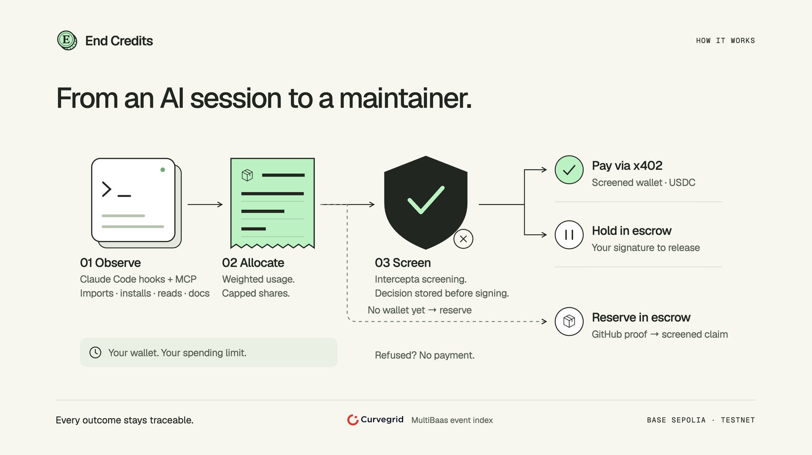
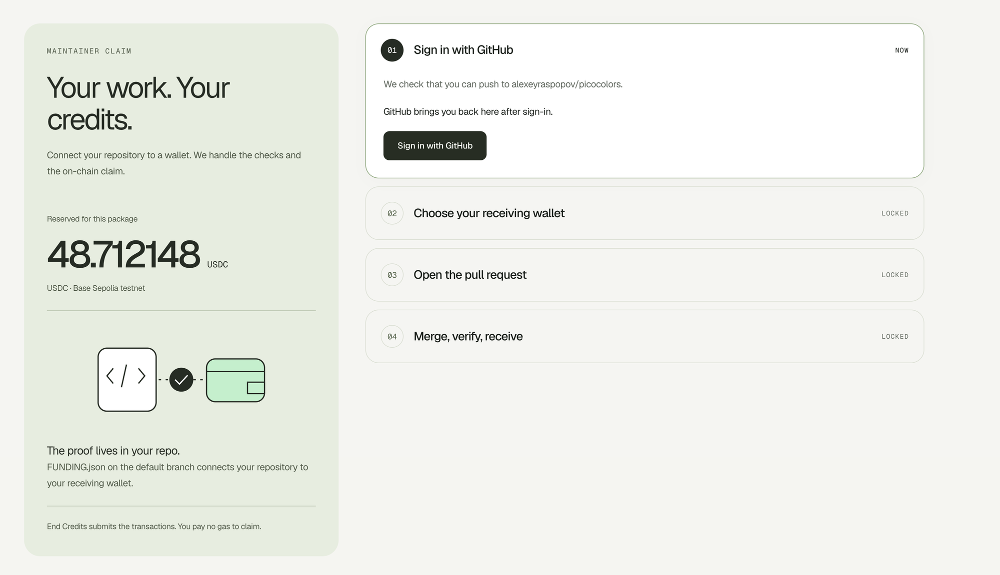

# End Credits

**Your AI agent tips the open-source packages it used, and never pays the scammers pretending to be
them.**

At the end of a Claude Code session, End Credits splits the developer's budget across the packages the
session actually used, screens every payee with **Intercepta** before anything is signed, pays clean
ones in USDC over **x402**, and holds or reserves the rest in an escrow. Every step is on chain and
shown on a dashboard built on **Curvegrid MultiBaas**.

<p>
  
  &nbsp;&nbsp;&nbsp;
  
</p>

ETHGlobal Tokyo 2026 · solo build by Faisal ([`zexoverz`](https://github.com/zexoverz)) · Base Sepolia

| | |
|---|---|
| App | https://end-credits.up.railway.app |
| Dashboard | https://end-credits.up.railway.app/dashboard |
| Recorded demo session | https://end-credits.up.railway.app/credits/5188c516-decd-4979-a0ef-1e4b23b88f60 |
| Proof for every claim | [VERIFY.md](VERIFY.md) |
| `EndCreditsEscrow` | [`0x849F…Cc46`](https://sepolia.basescan.org/address/0x849F6cd44e4A3248d033aBB1b670257F77bFCc46#code) (verified) |
| `EndCreditsBudget` | [`0x1429…0b36`](https://sepolia.basescan.org/address/0x1429498c0e6f2f474a5bd3230e79a838e3590b36#code) (verified) |

## Why

- Coding agents read docs and source instead of visiting project pages, so maintainers lose the
  traffic that used to bring sponsors. Tailwind's docs traffic is down about 40% and "75% of the
  people on our engineering team lost their jobs"
  ([Adam Wathan, Jan 2026](https://github.com/tailwindlabs/tailwindcss.com/pull/2388)).
- Of the top 1,000 npm packages, 41.6% publish funding metadata but only 2.1% publish a wallet an
  agent could pay ([our measurement](docs/details.md#measurement)).
- **Not a paywall.** It is opt-in for the developer; packages stay free for everyone.

## How it works



1. **Set up once.** Sign in with MetaMask, set a spending limit, install the CLI and connect Claude
   Code with a key. Your USDC stays in your own wallet; a contract lets your Agent wallet pull at most
   your limit, and one transaction revokes it.
2. **Work as usual.** A Claude Code hook records which packages the session imports, installs and
   reads. No code and no file paths leave your machine.
3. **End the session.** The budget is split by how much each package mattered, capped per package.
4. **Screen, then pay.** Each maintainer's published wallet is screened by Intercepta, the decision
   is stored, and only then is anything signed.
5. **The credits roll.** A page shows every package, what happened to its share and why, with a
   Basescan link.

| Outcome | When | Money |
|---|---|---|
| `paid` | clean payee | USDC over x402 straight to the maintainer (or to the maintainer's own x402 endpoint) |
| `refused` | sanctioned, scammer, phishing, address poisoning, lookalike, or a payment request that swaps the recipient | nothing sent |
| `held` | payout address changed recently, medium risk, or screening failed | in escrow until the developer's wallet signs the release; refunded on deny or expiry |
| `reserved` | the package publishes no wallet | in escrow until the maintainer proves the repo is theirs with a GitHub PR and claims it |

Held and refused examples are always our own `@endcredits-demo/*` fixtures, never real packages
([why](docs/details.md#demo-fixtures)).

## Live on Base Sepolia

The recorded demo session: Claude Code built a CLI for the library
[`typed-data-explain`](https://github.com/zexoverz/typed-data-explain), then the session was rolled.

| Package | Outcome | Tx |
|---|---|---|
| `viem` | paid over x402 | [`0x5ac3…081d`](https://sepolia.basescan.org/tx/0x5ac37e619a3fdca8e19d88a389d01a649bc202e36674d0d5f971920f7b0a081d) |
| `zod` | paid over x402 | [`0x22d9…7a15`](https://sepolia.basescan.org/tx/0x22d98a8017906c30c26cede0ecfc560e1f6ce3e77994cc377c7df2da13937a15) |
| `@endcredits-demo/tip-jar` | paid through the maintainer's own x402 endpoint | [`0x2497…fd05`](https://sepolia.basescan.org/tx/0x24974325bdd453e8fa718877d2f4fd2153f464dcb200ce7ec7d53a9ab38afd05) |
| `@endcredits-demo/moved-payout` | held, then released by the developer's MetaMask signature | [`0x848f…1276`](https://sepolia.basescan.org/tx/0x848f23500946f28df9520008d43afc64a9e217692fb2273cd65747d92f7b1276) |
| `@endcredits-demo/left-padder-pro` | refused: OFAC-sanctioned address, in Intercepta's words | none |
| `@endcredits-demo/swapped-jar` | refused: its x402 request named a different address than the one screened | none |
| `@endcredits-demo/unclaimed-utils` | reserved, then claimed by the maintainer through GitHub | [`setClaim`](https://sepolia.basescan.org/tx/0x74a0153930ff6c611bf1ebbcc836b07f4ce623a649691dfc1c6d79aec71157ec), [`claim`](https://sepolia.basescan.org/tx/0x8e7232d6def61e6c31a2ea90b06bac83f89d453e666edacb95582602fa093408) |

Across the event: 30 sessions from two developer accounts, 22 projects credited, 92 USDC paid to
maintainers in 28 payments, 185 USDC reserved for maintainers without a wallet. Live
numbers on the [dashboard](https://end-credits.up.railway.app/dashboard).

## Maintainer claim

Only 2.1% of the top 1,000 npm packages publish a wallet, so most shares start as `reserved`. The
maintainer claims them in about a minute on `/app/npm/<package>`, and pays no gas:

1. **Sign in with GitHub.** We check that they can push to the package's repository.
2. **Choose a receiving wallet** in MetaMask. Intercepta screens it before any money moves.
3. **Open the pull request.** It adds a `FUNDING.json` with that wallet; nothing else changes.
4. **Merge, verify, receive.** Once the file is on the default branch, End Credits records the claim
   on chain (`setClaim`) and releases every reserve for the package (`claim`).



Claimed on Base Sepolia:

| Package | When | `setClaim` | `claim` |
|---|---|---|---|
| `@endcredits-demo/unclaimed-utils` | recorded demo | [`0x74a0…57ec`](https://sepolia.basescan.org/tx/0x74a0153930ff6c611bf1ebbcc836b07f4ce623a649691dfc1c6d79aec71157ec) | [`0x8e72…3408`](https://sepolia.basescan.org/tx/0x8e7232d6def61e6c31a2ea90b06bac83f89d453e666edacb95582602fa093408) |
| `@endcredits-demo/unclaimed-rehearsal-2` | end-to-end rehearsal | [`0xe727…183c`](https://sepolia.basescan.org/tx/0xe7279aa1aae4c4f36c4cec7550768a26d96b60120ecad591ceb0cd78693e183c) | [`0x636f…2d53`](https://sepolia.basescan.org/tx/0x636f71ff4f381fac8a615909cc7829700b9d0220061d319c3b8b5ba5153d2d53) |
| `@endcredits-demo/unclaimed-rehearsal-1` | first rehearsal | [`0x9821…fea1`](https://sepolia.basescan.org/tx/0x982155da281f9e271a1d1eb0b7cf719cdaa66385be29d24f31b67688add9fea1) | [`0xf0bc…921d`](https://sepolia.basescan.org/tx/0xf0bce1f17720d8ef505d1cf02d4968ca25026d170ad0dd9bb593b1114456921d) |

## Intercepta: the moment of decision


- Every payee gets a quick scan, the address-poisoning check and token risks, in parallel, before
  any signature ([`lib/intercepta/client.ts`](lib/intercepta/client.ts)).
- The verdict picks the outcome: critical traits or `toxicScore > 50` refuse, 20 to 50 hold, clean
  pays ([decision matrix](docs/intercepta.md#decision-matrix-as-built)).
- A timeout or error holds, never pays; one retry on a transient failure.
- We pay on Base Sepolia but screen the maintainers' real addresses as their Base mainnet
  equivalents, and every row says so.
- At signing time, the x402 request must name the exact address that was screened; a request that
  swaps the recipient is refused before the signer runs.
- Our own paid x402 route screens who pays, and every maintainer claim wallet is screened too.

Full write-up, live results and API feedback: [docs/intercepta.md](docs/intercepta.md).

## Curvegrid MultiBaas: following the money


- Both contracts deployed and linked with the MultiBaas Forge plugin; Base Sepolia USDC linked too,
  so x402 payments are indexed next to escrow events.
- The whole dashboard is six saved event queries: paid, held by status, reserved per package,
  sessions, a 48 h timeline and a next-actions list
  ([`lib/multibaas/queries.ts`](lib/multibaas/queries.ts)). One OR query covers every account's
  Agent wallet.
- A signed webhook turns every `Held` event into a notification for the right account.

Full write-up, setup and what we learned: [docs/multibaas.md](docs/multibaas.md).

## Money safety

- **Budget contract:** the Agent wallet can pull at most the developer's limit per period, only
  what a session spends, and leftovers go straight back. No admin, no upgrade path.
- **Escrow:** a held tip is released only with the developer's EIP-712 signature over that exact
  payee and amount; the server cannot move it alone.
- **Each account has its own Agent wallet**, provisioned on first sign-in.

Details, threat model and tests: [docs/money.md](docs/money.md) and [docs/x402.md](docs/x402.md).

## The agent

Claude Code does the work; an End Credits MCP server lets it check status, roll its own credits and
explain every decision (`end_credits_status`, `end_credits_roll`, `end_credits_explain`). The model
reads and requests; the screen and the matrix decide who gets paid.

## Run it

```sh
git clone https://github.com/zexoverz/end-credits && cd end-credits
pnpm install && pnpm --filter endcredits build && (cd cli && npm link)
endcredits key <token>     # a connection key from /app/owner
endcredits init            # inside your project: adds the Claude Code hooks
```

Server setup, environment, tests and deployment: [docs/details.md](docs/details.md#setup-and-testing).

## More

- [docs/details.md](docs/details.md): attribution weights, honest limits, the npm measurement,
  deployed addresses, demo fixtures, setup.
- [docs/plan/](docs/plan): the spec and design written before any code, and
  [decisions.md](docs/plan/decisions.md), every choice made during the build.
- [AI_USAGE.md](AI_USAGE.md): built with Claude Code and Codex; every AI-written change is listed with
  what the builder reviewed. [AGENTS.md](AGENTS.md) holds the rules every agent run followed.
